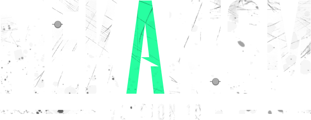

[](https://travis-ci.com/mekanism/Mekanism)



# Mekanism for Minecraft 1.16 #

Mekanism is a Minecraft add-on featuring high-tech machinery that can be used to create powerful tools, 
armor, and weapons. You can find more detail on the features at the [**Official Website**](http://aidancbrady.com/mekanism/).
Mekanism is an independent tech mod that brings low, mid, and high tier machinery to Minecraft. The 
mod doesn't have an actual goal, and you'll understand this when you see all the random content 
Mekanism contains, from jetpacks to balloons. However, I can assure you that you'll notice all the 
content blend together as you get to know the mod better!

Mekanism uses a tier-based system when organizing several of its core features, including Energy 
Cubes and Factories. There are four tiers: basic, the simplest tier, advanced, the second-most basic 
tier, elite, the second-most complex tier, and ultimate, the most complex tier. You can upgrade 
tiers by placing the component in a crafting grid and surrounding it with the necessary resources 
for the next upgrade.

By the time you've been using Mekanism for a while, you'll have a near-instructible suit of Obsidian 
Armor, be obtaining four ingots for each ore you mine, have the ability to fly wherever you want with 
the hydrogen-powered jetpacks, and have a cute robotic friend following you around while you mine. :)

# Discord #

Mekanism has a [discord](https://discord.gg/nmSjMGc) where you can come chat with other Mekanism users and the developers. Join us!

# Translating #

If you would like to help translate Mekanism, you can do so via [Crowdin](https://crowdin.com/project/mekanism)

# License #

Mekanism is under the MIT license. You may use it in modpacks, reviews or any other form as long as you abide by the terms below. 

Copyright 2017 Aidan C. Brady

Permission is hereby granted, free of charge, to any person obtaining a copy of this software and associated documentation files (the "Software"), to deal in the Software without restriction, including without limitation the rights to use, copy, modify, merge, publish, distribute, sublicense, and/or sell copies of the Software, and to permit persons to whom the Software is furnished to do so, subject to the following conditions:

The above copyright notice and this permission notice shall be included in all copies or substantial portions of the Software.

THE SOFTWARE IS PROVIDED "AS IS", WITHOUT WARRANTY OF ANY KIND, EXPRESS OR IMPLIED, INCLUDING BUT NOT LIMITED TO THE WARRANTIES OF MERCHANTABILITY, FITNESS FOR A PARTICULAR PURPOSE AND NONINFRINGEMENT. IN NO EVENT SHALL THE AUTHORS OR COPYRIGHT HOLDERS BE LIABLE FOR ANY CLAIM, DAMAGES OR OTHER LIABILITY, WHETHER IN AN ACTION OF CONTRACT, TORT OR OTHERWISE, ARISING FROM, OUT OF OR IN CONNECTION WITH THE SOFTWARE OR THE USE OR OTHER DEALINGS IN THE SOFTWARE.

# Maven
Mekansim v10+ is also available via [ModMaven](https://modmaven.k-4u.nl/) for developers wishing to make use of our API. Big thanks to K4Unl for hosting.

Update your `build.gradle` file to include the following. 

```groovy
repositories {
    maven { url 'https://modmaven.k-4u.nl/' }
}

dependencies {
    compileOnly "mekanism:Mekanism:${mekanism_version}:api"
    
    // If you want to test/use Mekanism & its modules during `runClient` invocation, use the following
    runtimeOnly fg.deobf("mekanism:Mekanism:${mekanism_version}")// core
    runtimeOnly fg.deobf("mekanism:Mekanism:${mekanism_version}:additions")// Mekanism: Additions
    runtimeOnly fg.deobf("mekanism:Mekanism:${mekanism_version}:generators")// Mekanism: Generators
    runtimeOnly fg.deobf("mekanism:Mekanism:${mekanism_version}:tools")// Mekanism: Tools
}
```

Add to `gradle.properties` (see [Maven](https://modmaven.k-4u.nl/mekanism/Mekanism/) for the list of available versions)

```properties
mekanism_version=1.16.1-10.0.0.423
```

# Credits #

  * aidancbrady
  * thommy101
  * thiakil
  * pupnewfster
  * dizzyd  
  * unpairedbracket
  * CyanideX (artwork)
  * Cheapshot (artwork)
  * Archadia (artwork)
  * micdoodle
  * Bluexin
  * JaSpr

## YourKit ##
YourKit supports open source projects with innovative and intelligent tools for monitoring and 
profiling Java and .NET applications. YourKit is the creator of [YourKit Java Profiler](https://www.yourkit.com/java/profiler), 
[YourKit .NET Profiler](https://www.yourkit.com/.net/profiler/) and [YourKit YouMonitor](https://www.yourkit.com/youmonitor/).
Mekanism uses YourKit for all our profiling needs!